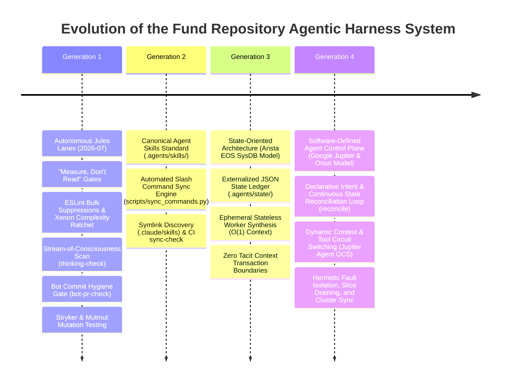
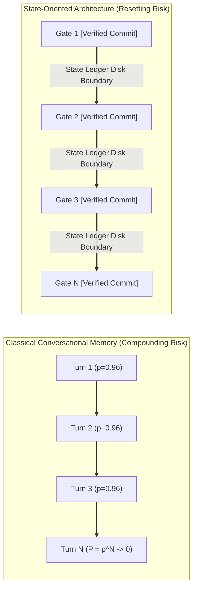
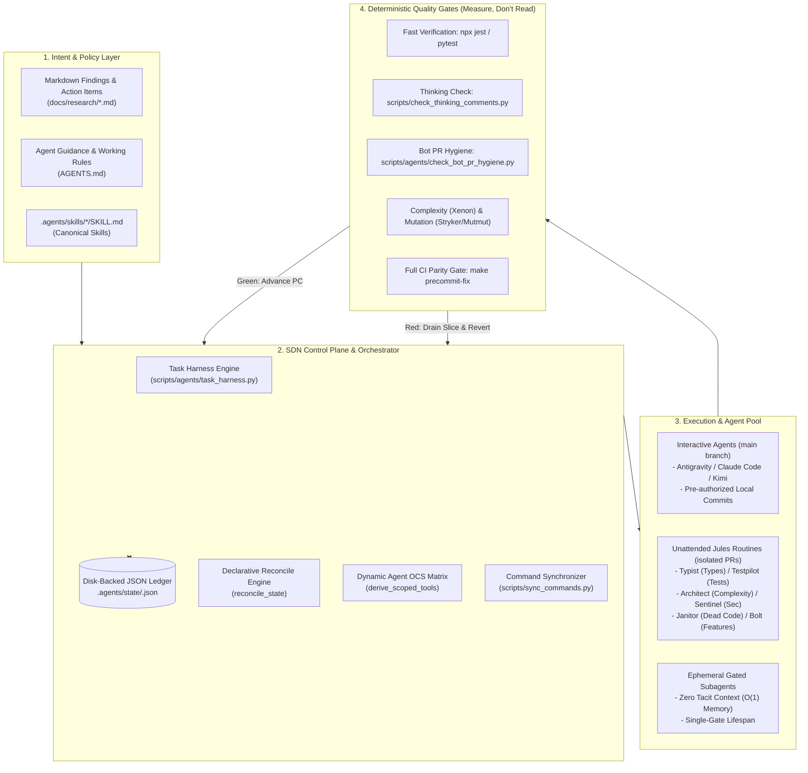
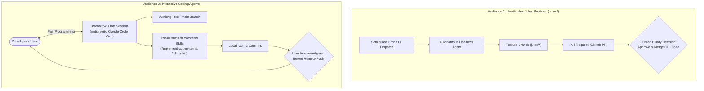
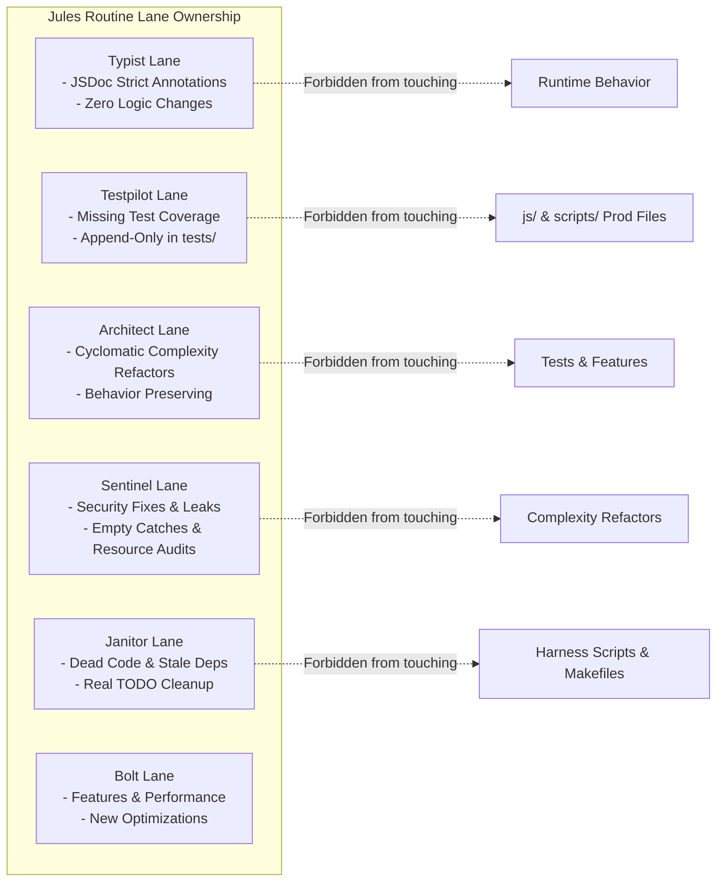
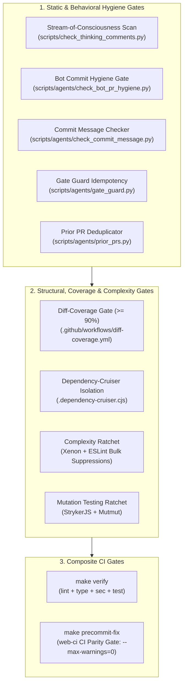
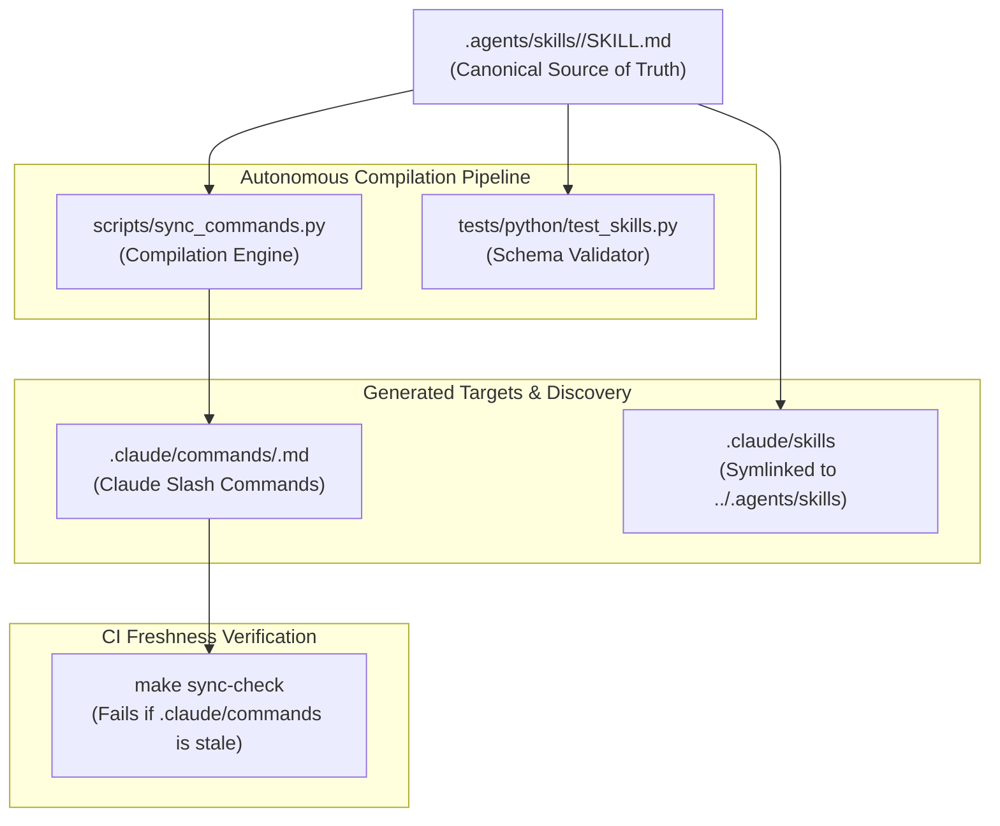
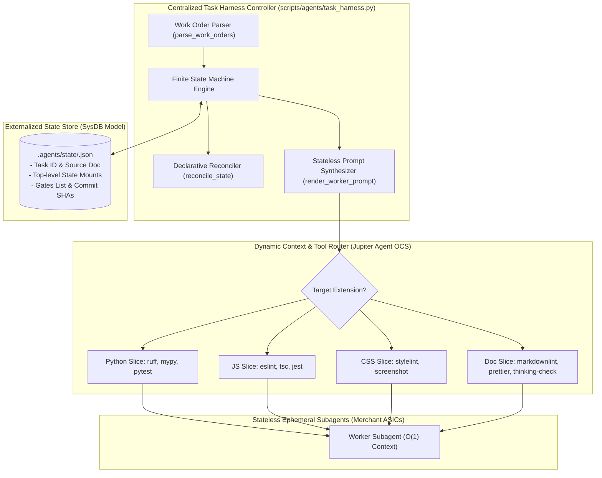
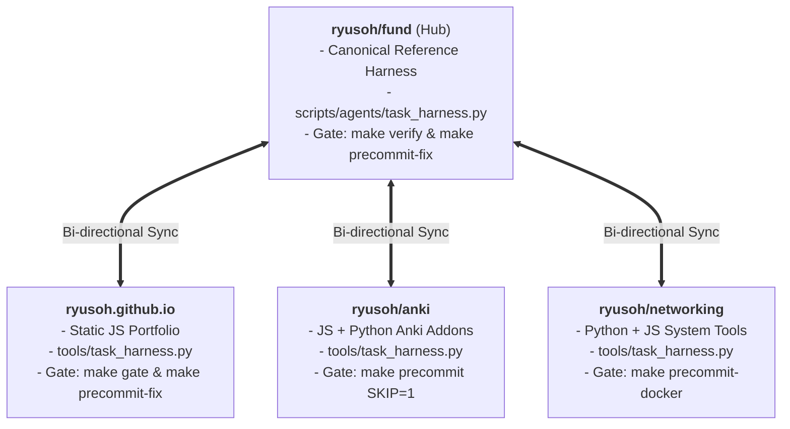

# Architecture of the Agentic Harness System

**Repository:** `ryusoh/fund`
**Status:** Canonical Master Reference Architecture
**Domain:** AI-Native Engineering, Software-Defined Agent Control Planes, Autonomous Workflows, Deterministic Quality Gates

---

## 1. Executive Summary & Evolutionary History

The `fund` repository implements a production-grade, state-oriented AI agent harness. It bridges autonomous background routines (Jules bots), interactive pair-programming agents (Antigravity, Claude Code, Kimi), automated execution skills, and deterministic quality gates into a cohesive, high-reliability engineering system.



### The Core Failure Modes of AI Coding Agents

Standard multi-turn LLM agent workflows suffer from four fatal vulnerabilities:

1. **The Multiplicative Reliability Decay ($P = p^N$)**: Multi-turn agents using conversational memory compound step-level errors exponentially.
2. **Context Pollution & Attention Degradation**: As chat history grows, autoregressive attention is diluted across irrelevant tokens, increasing hallucination rates.
3. **Monolithic Chassis Fragility**: Entrusting multi-file refactors to a single persistent agent creates single points of failure with catastrophic blast radii.
4. **Open-Loop Execution Drift**: Imperative scripts assuming step $N$ succeeds silently derail when intermediate assumptions fail.

### The System's Solution

The `fund` repository resolves these failure modes by treating AI agents not as conversational chatbots, but as **ephemeral, stateless computational transforms governed by a centralized, software-defined control plane**.

---

## 2. Theoretical & Mathematical Foundations

### 2.1 The Probability Decay Paradox

In classical multi-turn agent interactions, the agent uses conversational context as an in-memory execution ledger. For a task composed of $N$ sequential sub-tasks, each with independent step-level execution success probability $p_i \in (0, 1)$:

$$P(\text{Workflow Success}) = \prod_{i=1}^N p_i = p^N \xrightarrow[N \to \infty]{} 0$$

For example, with a high per-step accuracy of $p = 0.96$ on an $N = 15$ step implementation:

$$P(\text{Workflow Success}) = (0.96)^{15} \approx 0.542 \quad (45.8\% \text{ overall failure rate})$$



### 2.2 Attention Density & Token Growth

As conversational token length $L$ expands, the model's effective attention density $D_{\text{attn}}(L)$ degrades inversely:

$$D_{\text{attn}}(L) \propto \frac{1}{1 + \alpha L}, \quad \alpha > 0$$

Under monolithic conversational execution, total token consumption $C_{\text{token}}(N)$ grows quadratically with turn count $N$, whereas stateless gated dispatch maintains constant token overhead per gate:

$$C_{\text{monolithic}}(N) = \sum_{k=1}^N \mathcal{O}(k \cdot \bar{L}_{\text{turn}}) = \mathcal{O}(N^2), \qquad C_{\text{gated}}(N) = \sum_{k=1}^N \mathcal{O}(\bar{L}_{\text{slice}}) = \mathcal{O}(N)$$

### 2.3 Declarative State Convergence Function

Let $S_{\mathrm{declared}}$ be the target intent specified in an action items document, $S_{\mathrm{git}}$ be the ground truth git DAG, and $S_{\mathrm{disk}}$ be the externalized JSON state ledger. The control plane implements a continuous reconciliation operator $\mathcal{R}$:

$$\mathcal{R} : S_{\mathrm{git}} \times S_{\mathrm{disk}} \times S_{\mathrm{declared}} \longrightarrow S_{\mathrm{disk}}'$$

The Program Counter ($PC$) identifies the exact minimal unresolved gate:

$$PC = \min \Big( \{i \in \{1, \dots, N\} \mid \text{Status}(g_i) \notin \{\text{DONE}, \text{SKIPPED}\}\} \cup \{\infty\} \Big)$$

Convergence is achieved when $PC = \infty$ (all gates $\in \{\text{DONE}, \text{SKIPPED}\}$ with verified git commit SHAs).

---

## 3. High-Level System Architecture



---

## 4. The Two-Audience Operating Model

The repository establishes a fundamental distinction between **Unattended Jules Routines** and **Interactive Coding Agents** in `AGENTS.md`.



### 4.1 Audience Comparison Matrix

| Property                | Unattended Jules Routines (`.jules/`)                        | Interactive Coding Agents (Antigravity, Claude, etc.)                                       |
| :---------------------- | :----------------------------------------------------------- | :------------------------------------------------------------------------------------------ |
| **Human in the Loop**   | None during execution; zero review iteration.                | Continuous pair-programming and real-time guidance.                                         |
| **Review Standard**     | Binary approve/close in $\le 10$ seconds. No comments left.  | Interactive diff review in IDE / terminal.                                                  |
| **Optimization Target** | **Approve rate**, smallest possible diff, zero scope creep.  | Problem resolution speed, architectural depth, thoroughness.                                |
| **Branching Strategy**  | Never touches `main`; isolated branch $\to$ GitHub PR.       | Works directly on `main`; branches only when directed.                                      |
| **Commit Authority**    | Commits to PR branch with bot author trailer.                | Local commits pre-authorized for workflow skills; remote push gated on user acknowledgment. |
| **Scope Limits**        | Strict lane boundaries; forbidden from touching other lanes. | Full repo access; may edit build configs, Makefiles, and `.jules/`.                         |

---

## 5. Jules Personas & The Lane Ownership Matrix

To prevent unattended background bots from colliding or causing scope creep, each Jules persona owns a disjoint vertical lane:



### Lane Boundary Specifications

| Routine       | Owns Exclusively                                                  | Must NOT Touch                                               | Verification Target                                           |
| :------------ | :---------------------------------------------------------------- | :----------------------------------------------------------- | :------------------------------------------------------------ |
| **Typist**    | JS strict-type annotations (JSDoc `@param`, `@returns`).          | Runtime logic, branching, or behavior.                       | `npx tsc -p jsconfig.json` strict error count drops.          |
| **Testpilot** | Test additions, edge case assertions, coverage floors.            | Production code (`js/`, `scripts/`).                         | `make test` coverage increases; tests are append-only.        |
| **Architect** | Cyclomatic complexity refactors (breaking up mega-functions).     | Error handling, tests, feature changes.                      | `xenon` / ESLint complexity decreases; tests stay 100% green. |
| **Sentinel**  | Security vulnerabilities (Bandit), resource leaks, bare `except`. | Complexity refactors or performance tweaks.                  | Bandit clean; error handling verified.                        |
| **Janitor**   | Dead code removal, stale package dependencies, real TODOs.        | Tooling (`scripts/agents/`, `bin/`, `Makefile`, `.agents/`). | Zero test regressions; dead symbols removed.                  |
| **Bolt**      | Features, performance optimizations, rendering speed.             | Anything owned by another lane in the same PR.               | Benchmark measurements, `make verify`.                        |

---

## 6. Pre-Existing Quality Gates ("Measure, Don't Read")

Before today's control plane enhancements, the repository established a rigorous "Measure, Don't Read" quality gate infrastructure inspired by Uncle Bob's automated verification philosophy.



### Detailed Gate Specifications

#### 1. Stream-of-Consciousness / Cognitive Leakage Guard (`make thinking-check`)

- **Script**: `scripts/check_thinking_comments.py`.
- **Purpose**: Scans all tracked py/js/ts/css files for model thinking-out-loud remnants (`Wait,`, `Ah,`, `Let me check`, `Oops,`, abandoned `pass`-only test bodies).
- **Invariant**: Code comments must state facts about behavior; reasoning trails belong in PR descriptions or scratch files.

#### 2. Bot PR Hygiene Gate (`make bot-pr-check`)

- **Script**: `scripts/agents/check_bot_pr_hygiene.py`.
- **Purpose**: Inspects all bot-authored commits in `origin/main..HEAD`.
- **Invariants**:
    - Rejects empty commits (zero changed files).
    - Rejects placeholder files (e.g. `dummy_file.txt` added and deleted).
    - Rejects line deletions in test files (bot lanes are strictly append-only in `tests/`).
    - Rejects stray bot artifacts (`pr_body.txt`, `pr_description.txt`, scratch files).
    - Enforces complexity ratchet integrity on `eslint-suppressions.json` (rejects new suppressions / count increases; lane-restricted to Architect `refactor` commits).

#### 3. Gate Guard Idempotency (`scripts/agents/gate_guard.py`)

- **Purpose**: Prevents unattended routines from wasting runs against an untouched worktree. Takes a hash snapshot before the run; blocks retrying red gates if the tree has not changed.

#### 4. Complexity Ratchet (Xenon + ESLint Bulk Suppressions)

- **Python**: `xenon --max-average C --max-modules F --max-absolute F scripts tests`.
- **JavaScript**: ESLint `complexity: ['error', { max: 20 }]` baselined via `eslint-suppressions.json`.
- **Ratcheting Mechanism**: Legacy code is baselined; newly added code cannot introduce high-complexity blocks. As functions are refactored, `npx eslint --prune-suppressions` permanently ratchets down the ceiling.

#### 5. Mutation Testing Ratchet (`make mutate-js`, `make mutate-py`)

- **Tools**: StrykerJS (`.stryker.config.json`) and Mutmut.
- **Principle**: Coverage only proves code _ran_; mutation testing proves tests _assert_. Mutants injected into code must be killed by failing tests.

#### 6. Dependency Architecture & Boundary Gate (`make depcheck`)

- **Tool**: Dependency-Cruiser (`.dependency-cruiser.cjs`).
- **Invariants**: Prohibits circular dependencies and strictly forbids cross-page imports (e.g. terminal code importing from calendar or position pages).

---

## 7. The Agent Skills & Slash Commands Engine

The repository organizes reusable workflows into **Agent Skills** following the open Agent Skills standard.



### Canonical Skills Registry

| Skill Name                   | Invocation                | Role & Operational Workflow                                                                                                             |
| :--------------------------- | :------------------------ | :-------------------------------------------------------------------------------------------------------------------------------------- |
| **`action-items`**           | `/action-items`           | Compiles a research/findings document into mechanical, anchor-verified work orders for downstream execution.                            |
| **`implement-action-items`** | `/implement-action-items` | Executes work orders sequentially; validates Find anchors, executes target changes, verifies with scoped commands, and commits locally. |
| **`tdd`**                    | `/tdd`                    | Test-Driven Development red-green-refactor loop; generates failing tests first, implements minimal code, verifies, and refactors.       |
| **`ship`**                   | `/ship`                   | Final verification gate; runs full CI suite, squash-merges branch, deletes worktrees, and pushes to remote with user authorization.     |
| **`research`**               | `/research`               | Primary source research investigation against authoritative literature and specifications; emits cited findings doc.                    |
| **`retro`**                  | `/retro`                  | Retrospective compounding loop; turns session friction into durable repository rules, gates, and skill improvements.                    |
| **`diagnosing-bugs`**        | `/diagnosing-bugs`        | Structured diagnosis loop for hard bugs and performance regressions; generates minimal reproductions before patching.                   |
| **`sibling-repo-sync`**      | `/sibling-repo-sync`      | Propagates harness, tooling, and gate improvements across the four sibling repositories with perspective-flipped adaptations.           |
| **`sync-commands`**          | `/sync-commands`          | Compiles `.agents/skills/` into `.claude/commands/` and validates symlink integrity.                                                    |
| **`jules-persona`**          | `/jules-persona`          | Tunes scheduled prompts and enhances `.jules/<name>.md` personas to match repo house conventions.                                       |

---

## 8. Today's State-Oriented SDN Upgrades (Arista EOS & Google Jupiter/Orion)

Today's architectural enhancement integrates the **Arista EOS SysDB** state separation model and **Google Jupiter / Orion SDN Control Plane** principles into the harness:



### 8.1 The State Ledger Finite State Machine (`task_harness.py`)

The state machine manages work order lifecycles through explicit CLI commands:

```bash
# Initialize state ledger from markdown findings doc
python3 -m scripts.agents.task_harness init docs/research/task.md

# Inspect current Program Counter (active gate) as JSON
python3 -m scripts.agents.task_harness current

# Synthesize hermetic, zero-tacit-context prompt for active gate (Agent OCS)
python3 -m scripts.agents.task_harness render-worker-prompt 1

# Reconcile state against git DAG ground truth
python3 -m scripts.agents.task_harness reconcile

# Record verified git commit SHA for a gate
python3 -m scripts.agents.task_harness record-commit 1 <commit_sha>

# Mark non-viable gate as skipped
python3 -m scripts.agents.task_harness skip 2 --reason "Deferred to follow-up"

# Final verification that all gates are resolved
python3 -m scripts.agents.task_harness verify-all
```

### 8.2 Dynamic Optical Circuit Switching (Agent OCS) Matrix

Just as Google Jupiter dynamically reconfigures optical switches to match traffic patterns, the prompt synthesizer dynamically binds only the tools and rules relevant to the active gate:

```python
def derive_scoped_tools(target_file: str) -> list[str]:
    """Derive minimal required toolset based on target file type (Jupiter OCS routing)."""
    p = target_file.lower().strip()
    if p.endswith(".py"):
        return ["ruff (lint)", "mypy (types)", "pytest (test)", "view_file", "replace_file_content"]
    if p.endswith((".js", ".mjs", ".jsx")):
        return ["eslint (lint)", "tsc (types)", "jest (test)", "view_file", "replace_file_content"]
    if p.endswith(".css"):
        return ["stylelint (lint)", "screenshot (visual)", "view_file", "replace_file_content"]
    if p.endswith(".md"):
        return ["markdownlint", "prettier", "thinking-check", "view_file", "replace_file_content"]
    return ["view_file", "replace_file_content", "scoped verify command"]
```

---

## 9. Cluster-Wide Mesh Synchronization

The repository functions as the hub of a 4-repository cluster. Tooling and architectural improvements are synchronized via `/sibling-repo-sync`:



### Cluster Invariants & Adaptation Rules

1. **Perspective-Flipped Authoring**: Each repository maintains its own copy of `AGENTS.md` and skills written from its local viewpoint.
2. **Tooling Path Adaptation**: Python tooling paths adapt between `scripts/agents/` (`fund`) and `tools/` (`ryusoh.github.io`, `anki`, `networking`).
3. **Uncommitted Sync Review**: Sibling repository modifications remain uncommitted for explicit user inspection before push.

---

## 10. Master Reference & Command Cheat Sheet

```text
+-----------------------------------------------------------------------------------------+
|                              AGENTIC HARNESS COMMAND CHEAT SHEET                        |
+-----------------------------------------------------------------------------------------+
| WORKFLOW COMMAND                     | PURPOSE & INVOCATION                             |
+--------------------------------------+--------------------------------------------------+
| make verify                          | Full checks: lint + types + sec + tests          |
| make precommit-fix                   | CI parity gate (web-ci: --max-warnings=0)        |
| make thinking-check                  | Scan for stream-of-consciousness comments        |
| make bot-pr-check                    | Verify Jules bot PR commit hygiene               |
| make depcheck                        | Verify JS modular dependency boundaries          |
| make sync-check                      | Check generated Claude commands freshness        |
| make mutate-js / mutate-py           | Run Stryker / Mutmut mutation test ratchets      |
| /action-items <doc>                  | Compile findings doc into tagged work orders     |
| /implement-action-items <doc>        | Execute work orders sequentially with commits    |
| /tdd                                 | Test-driven red-green-refactor loop              |
| /ship                                | Final verify, squash-merge, push gate            |
| /research                            | Deep primary source investigation                |
| /retro                               | Friction-to-improvement compounding loop         |
| /sibling-repo-sync                   | Propagate tooling across cluster repos           |
| python3 -m ...task_harness init      | Initialize JSON state ledger from doc            |
| python3 -m ...task_harness reconcile | Reconcile state against git ground truth         |
| python3 -m ...task_harness current   | Print active Program Counter gate                |
+-----------------------------------------------------------------------------------------+
```

---

## 11. Architectural Axioms Summary

$$ \begin{aligned}
\text{State Ledger} &\implies \text{Externalized Disk JSON File (Arista SysDB Model)} \\
\text{Orchestration Control} &\implies \text{Centralized Declarative SDN Engine (Google Orion Model)} \\
\text{Subagent Execution} &\implies \mathcal{O}(1) \text{ Ephemeral Single-Gate Lifetime (Merchant Silicon Clos)} \\
\text{Tool Provisioning} &\implies \text{Dynamic Adaptive Slicing (Google Jupiter OCS)} \\
\text{Quality Assurance} &\implies \text{Automated Layered Gates (Measure, Don't Read)} \\
\text{Verification Authority} &\implies \text{Strict Deterministic CI Parity (make precommit-fix)}
\end{aligned}$$
$$
