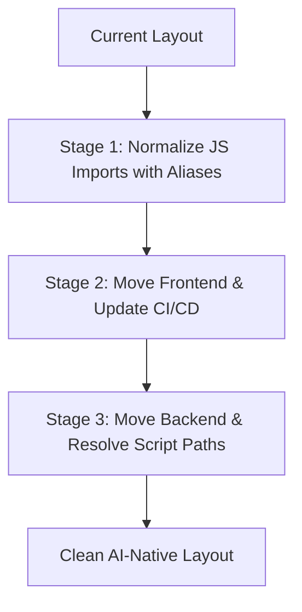

# Research: AI-Native Repository Structure

This document explores how frontier AI research labs structure their codebases and proposes a set of design principles and structural recommendations to transform a codebase into an **AI-Native Repository**—optimized for maximum efficiency, accuracy, and autonomy when edited by AI agents.

---

## 1. How Frontier Labs Structure Repositories

Frontier AI labs operate at the intersection of extreme-scale infrastructure, rapid scientific research, and production software engineering. Their repository architectures generally center around a few key paradigms:

### A. The Managed Monorepo (Bazel/Pants/Nx)

- **Scale**: Labs typically keep research, data pipelines, model training, evaluation harnesses, and web applications in a single monorepo.
- **Hermetic Builds**: They use build systems like **Bazel** (popular at Google/GDM) or **Pants** (popular in Python-heavy environments) to ensure builds are completely reproducible, hermetic, and cached.
- **Impact**: If a researcher changes a model architecture, the system knows exactly which downstream evaluation tasks and production endpoints are affected and triggers only those tests.

### B. First-Class Evaluation Directories (`/evals`)

- **Evals as a Contract**: Evals are not just unit tests; they measure model capability, behavioral drift, and safety regressions.
- **Structure**: Every core model or agent system has a sibling `/evals` or `/benchmarks` directory containing datasets, expected outputs, and scoring scripts. Model promotion in CI/CD is dependent on passing these evals.

### C. Rigid Separation of Training vs. Serving vs. Tooling

- **Training (`/train` or `/research`)**: Highly dynamic, historically messy, and notebook-heavy. However, modern labs enforce configuration frameworks (like **Hydra**, **Gin**, or typed configs) to separate code logic from hyperparameters.
- **Serving (`/serving` or `/inference`)**: Low-latency C++, Rust, or optimized Python (TGI, vLLM, TensorRT-LLM) with strict typing, rigorous memory profiling, and load testing.
- **Tooling/UI (`/playground` or `/apps`)**: Web interfaces, data labeling tools, and agent playgrounds. These are usually TypeScript/React apps communicating with the backend via strongly typed RPCs (like gRPC, Protocol Buffers, or OpenAPI schemas).

---

## 2. Core Constraints of AI Agents

To design an **AI-Native Repository**, we must design for the cognitive and technical constraints of LLM-based agents:

| Constraint                       | Description                                                                                                            | AI-Native Mitigation                                             |
| :------------------------------- | :--------------------------------------------------------------------------------------------------------------------- | :--------------------------------------------------------------- |
| **Context Window Limits**        | LLMs have finite attention spans. Huge files (>500 lines) consume tokens and cause the model to lose track of details. | Modular, single-responsibility files and strict boundaries.      |
| **High Search & Discovery Cost** | Searching files, running ripgrep, and browsing directories takes time, tool calls, and tokens.                         | Self-documenting paths, root-level maps, and clean code layouts. |
| **Indeterminacy of Environment** | Agents struggle when setup, building, linting, or testing commands are obscure or change frequently.                   | Standardized task runner interfaces (e.g., `Makefile`).          |
| **Loss of State Across Turns**   | Standard git commits don't explain _why_ an agent did something, and context is lost between chat sessions.            | File-based memory/artifacts (e.g., `task.md`, `.cursorrules`).   |

---

## 3. Principles of an AI-Native Repository

An AI-Native Repository is optimized for a machine-in-the-loop workflow. It should follow four main principles:

1. **Self-Documenting & Navigable**: An agent should be able to read one or two root files and instantly understand where everything is and how the system fits together (e.g., via `REPO_MAP.md`).
2. **Deterministic Interface (Unified Task Runner)**: The agent should not need to inspect `package.json` to find frontend commands and `pyproject.toml`/`Makefile` to find backend commands. There should be a single, unified command interface (e.g., `Makefile`).
3. **Low Context Footprint & Strict Boundaries**: Code should be highly modular. Interfaces between modules should be typed so that an agent editing module `A` does not need to read the implementation of module `B`—only its types/interfaces.
4. **Explicit Agent State & Memory**: The repo should reserve directories for agents to store their execution states, tasks, and rules.

---

## 4. Proposed Repository Structure for a Hybrid Project

Based on these principles, here is how a hybrid Python/JavaScript repository can be restructured to optimize it for AI agents:

```text
/fund (Repository Root)
├── .github/                  # CI/CD pipelines (agent run verifications)
├── .gemini/                  # App data directory for agent memory
│   └── prompt_rules/         # Agent-specific instructions (e.g., lint rules)
├── .cursorrules              # Global rules for Cursor/Claude/Gemini IDE integrations
├── REPO_MAP.md               # A high-level map explaining where features live
├── Makefile                  # The single source of truth for ALL commands
│
├── docs/                     # Architectural documents and design decisions
│   ├── architecture.md       # High-level system design
│   └── ai_native_repo_structure.md  # This document
│
├── frontend/                 # Unified JS/TS client
│   ├── package.json          # Dependencies for JS
│   ├── src/                  # Standardized source directory
│   │   ├── components/       # Highly modular, pure UI components
│   │   ├── hooks/            # State and side effects
│   │   └── index.tsx         # Entry point
│   ├── tsconfig.json         # Strict TypeScript settings
│   └── tests/                # Frontend unit and component tests
│
├── backend/                  # Unified Python engine
│   ├── pyproject.toml        # Unified Python dependencies and tool configs
│   ├── src/                  # Standardized Python source directory
│   │   ├── analysis/         # Analysis scripts
│   │   ├── position/         # Position engine
│   │   └── terminal/         # CLI / terminal interface
│   └── tests/                # Python pytest suite
│
├── schemas/                  # Shared contracts (OpenAPI, JSON schema, or Protobuf)
│   └── api.yaml              # The exact contract between backend and frontend
│
└── scripts/                  # Internal automation scripts
    └── bootstrap.sh          # One-click environment setup script
```

### Key Reorganization Concepts

#### 1. Move JavaScript/CSS into a unified `frontend/` directory

Grouping these into `/frontend` prevents the agent from getting confused by root-level config files. It separates the JS environment context entirely from the Python environment context.

#### 2. Move Python modules into a unified `backend/` directory

Nesting these under `/backend` (or `/core`) creates a clear logical separation. The agent immediately knows that anything under `backend/` is Python code governed by `pyproject.toml`.

#### 3. Introduce `REPO_MAP.md` at the Root

This file is a cheat sheet for the AI. It outlines the directories, the core technologies used, and the locations of key business logic.

#### 4. The Unified `Makefile` Contract

The `Makefile` should map all agent operations. This allows the agent to run commands blindly but successfully. Examples of targets:

- `make bootstrap`
- `make lint`
- `make test`
- `make dev`

#### 5. Strict Interface Typing (`/schemas`)

Pydantic exported JSON schemas, OpenAPI specifications, or Protocol Buffers create a compile-time boundary. If the agent modifies the backend API, the frontend compile fails immediately, giving the agent a direct feedback loop to fix its own code.

---

## 5. URL and Routing Preservation (Decoupling Code vs. Delivery)

A common concern when moving static website entries (like `/terminal`, `/position`) into a subfolder like `/frontend` is that public URL endpoints will break or change to `/frontend/terminal` or `/frontend/position`.

This concern is resolved by **decoupling the physical repository layout from the public routing structure**. Repository structure is optimized for **AI developer ergonomics**, while deployment routing is optimized for **user navigation**.

There are two primary ways to manage this separation depending on the deployment strategy:

### A. Deploying Static Roots (Cloudflare Pages, Vercel, Netlify)

If the project is hosted on a static provider (e.g., Cloudflare Pages via `wrangler` or Vercel), the build configuration allows specifying a **Root Directory** or **Publish Directory**:

- **Root Directory (Source)**: Set to `frontend/`. The hosting provider treats this folder as the git root for builds.
- **Publish Directory (Output)**: Set to `frontend/` (or the build output like `frontend/dist`).
- **Result**: When deployed, `frontend/terminal/index.html` becomes the server root's `/terminal/index.html`. Users still visit `fund.lyeutsaon.com/terminal`, keeping URLs completely unchanged.

### B. Bundler-Based Rewrite Rules (Vite, Webpack, Next.js)

If using a modern frontend bundler inside `frontend/`, entry-point aliases or output path overrides can map folder paths to clean outputs:

- For MPA (Multi-Page Apps), configure Vite/Webpack to fetch inputs from `frontend/src/pages/` and output them as flat files:

    ```js
    // vite.config.js example
    export default {
        build: {
            rollupOptions: {
                input: {
                    main: 'index.html',
                    terminal: 'src/pages/terminal/index.html',
                    position: 'src/pages/position/index.html',
                },
            },
        },
    };
    ```

- The built artifact directory (e.g., `dist/`) is served at the domain root, so files are mapped back to their canonical URLs `/terminal` and `/position`.

### C. Server-Level Aliasing (Nginx, Apache, or dev_server.py)

If using a custom dev server (such as Python's `SimpleHTTPRequestHandler`), we can run the server with the root pointed to the `frontend/` directory instead of the project root:

```bash
# Old dev command:
python3 scripts/dev_server.py 8000  # served root (included terminal/ at root)

# New dev command:
cd frontend && python3 ../scripts/dev_server.py 8000  # serves frontend/ at root
```

This preserves `localhost:8000/terminal/` locally just as it is in production.

---

## 6. Restructuring Strategies & Migration Plan (Managing Risk)

Physical reorganizations of a live codebase run the risk of breaking paths, imports, and CI/CD pipelines. To manage this risk in a hybrid repository, two strategies are recommended:

### Strategy 1: The "Virtual" AI-Native Repo (Zero-Risk, High-Reward)

For codebases where physical file movement is too risky, we can construct a virtual layer that gives AI agents the same context and validation capabilities without altering any directory paths:

1. **Create `REPO_MAP.md` at the Root**: Map current paths to functional areas (e.g. `scripts/analysis/` -> backend engine, `js/pages/` -> page logic).
2. **Unified `Makefile`**: Bind all testing, formatting, and linting commands under a root `Makefile` so the agent has a single command interface.
3. **Agent Rules (`.cursorrules` or `.geminiprompt`)**: Provide prompt-level rules to guide the agent through the codebase structure.

- **Impact**: Zero downtime, zero code changes, 90% of the developer experience benefits for AI agents.

### Strategy 2: Incremental, Test-Driven Restructuring (Controlled Physical Migration)

If a physical layout change is desired, it should be executed in discrete, tested stages instead of a single massive change:



- **Stage 1: Import Path Normalization (JS & Python)**
    - Replace relative JS imports (e.g., `../../utils.js`) with path aliases (e.g., `@utils/utils.js`) which are already configured in Jest. Once aliases are used, physical movement will not break imports.
- **Stage 2: Frontend Migration**
    - Create `/frontend` and move `js/`, `css/`, `package.json`, and page entrypoints.
    - Update the GitHub Pages workflow publish path from `.` to `frontend`.
    - Update `scripts/dev_server.py` to serve the `frontend/` directory.
    - Run JS Jest tests and verify local UI.
- **Stage 3: Backend Migration**
    - Create `/backend` and move `scripts/analysis/`, `pyproject.toml`, and python tests.
    - Ensure python scripts resolve data paths (like `data/analysis/`) relative to their execution location or via an environment variable rather than hardcoded root paths.
    - Run python `pytest` and linters to verify.
