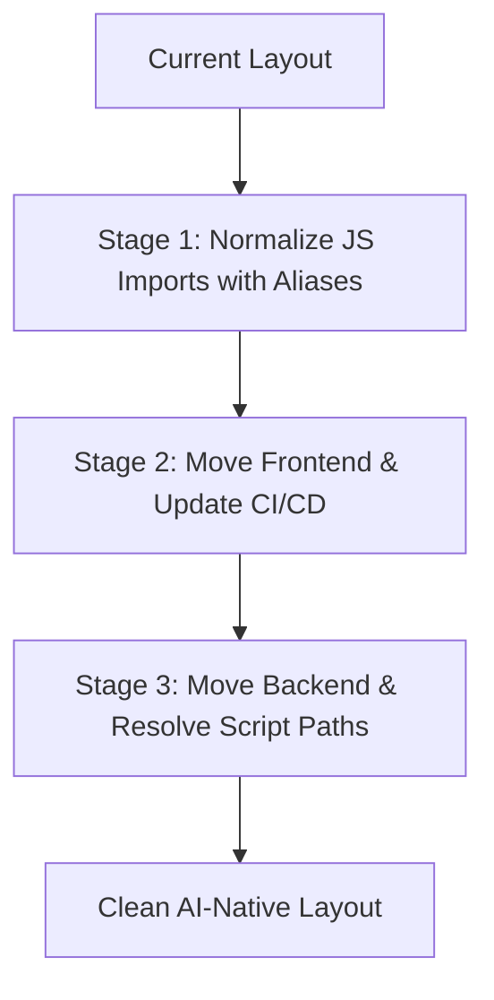
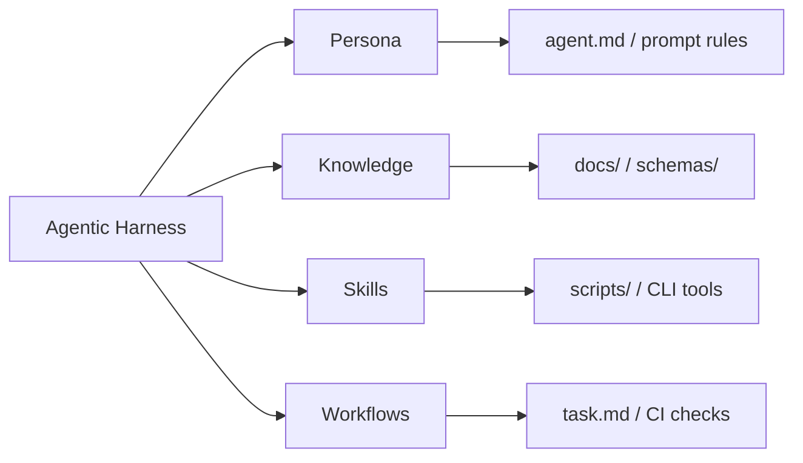

# Research: AI-Native Repository Structure

This document explores how frontier AI research labs structure their codebases and proposes a set of design principles and structural recommendations to transform a codebase into an **AI-Native Repository**—optimized for maximum efficiency, accuracy, and autonomy when edited by AI agents.

---

## 1. How Frontier Labs Structure Repositories

Frontier AI labs operate at the intersection of extreme-scale infrastructure, rapid scientific research, and production software engineering. Their repository architectures generally center around a few key paradigms:

### A. The Managed Monorepo (Bazel/Pants/Nx)

- **Scale**: Labs typically keep research, data pipelines, model training, evaluation harnesses, and web applications in a single monorepo.
- **Hermetic Builds**: They use build systems like **Bazel** (popular at Google/GDM) or **Pants** (popular in Python-heavy environments) to ensure builds are completely reproducible, hermetic, and cached.
- **Impact**: If a researcher changes a model architecture, the system knows exactly which downstream evaluation tasks and production endpoints are affected and triggers only those tests.

### B. First-Class Evaluation Directories (`/evals`)

- **Evals as a Contract**: Evals are not just unit tests; they measure model capability, behavioral drift, and safety regressions.
- **Structure**: Every core model or agent system has a sibling `/evals` or `/benchmarks` directory containing datasets, expected outputs, and scoring scripts. Model promotion in CI/CD is dependent on passing these evals.

### C. Rigid Separation of Training vs. Serving vs. Tooling

- **Training (`/train` or `/research`)**: Highly dynamic, historically messy, and notebook-heavy. However, modern labs enforce configuration frameworks (like **Hydra**, **Gin**, or typed configs) to separate code logic from hyperparameters.
- **Serving (`/serving` or `/inference`)**: Low-latency C++, Rust, or optimized Python (TGI, vLLM, TensorRT-LLM) with strict typing, rigorous memory profiling, and load testing.
- **Tooling/UI (`/playground` or `/apps`)**: Web interfaces, data labeling tools, and agent playgrounds. These are usually TypeScript/React apps communicating with the backend via strongly typed RPCs (like gRPC, Protocol Buffers, or OpenAPI schemas).

---

## 2. Core Constraints of AI Agents

To design an **AI-Native Repository**, we must design for the cognitive and technical constraints of LLM-based agents:

| Constraint                       | Description                                                                                                                                                                                              | AI-Native Mitigation                                                                        |
| :------------------------------- | :------------------------------------------------------------------------------------------------------------------------------------------------------------------------------------------------------- | :------------------------------------------------------------------------------------------ |
| **Context Economy**              | Modern context windows are large (200k–1M tokens), but context is priced per token and attention dilutes as it fills. The binding constraint is not "can the file fit" but "what else gets crowded out." | Single-responsibility files; load interfaces instead of implementations; stable summaries.  |
| **High Search & Discovery Cost** | Searching files, running ripgrep, and browsing directories takes time, tool calls, and tokens. Generic names (`utils.js`, `helpers.py`, `index.js` everywhere) make search results noisy.                | Self-documenting paths, distinctive file/function names, root-level maps.                   |
| **Imprecise Edits**              | Agents edit via exact-string or patch tools. Near-duplicate code blocks and repeated boilerplate cause edits to match the wrong site or fail outright.                                                   | Deduplicate aggressively; keep unique anchors (distinct names, comments) near edit targets. |
| **Indeterminacy of Environment** | Agents struggle when setup, building, linting, or testing commands are obscure or change frequently.                                                                                                     | Standardized task runner interfaces (e.g., `Makefile`).                                     |
| **Slow Feedback Loops**          | Agents work in tight edit→verify cycles, often dozens per task. A 10-minute test suite or a lint that can only run repo-wide multiplies every mistake's cost.                                            | Fast, _scoped_ verification: per-file lint, per-suite tests, incremental type-checking.     |
| **Loss of State Across Turns**   | Standard git commits don't explain _why_ an agent did something, and context is lost between chat sessions.                                                                                              | Auto-loaded context files (`AGENTS.md`/`CLAUDE.md`), memory dirs, task sheets (`task.md`).  |

---

## 3. Principles of an AI-Native Repository

An AI-Native Repository is optimized for a machine-in-the-loop workflow. It should follow five main principles:

1. **Self-Documenting & Navigable**: An agent should be able to read one or two root files and instantly understand where everything is and how the system fits together. Critically, this knowledge belongs in the file the harness **auto-loads** — `AGENTS.md` (the cross-tool standard adopted by Codex, Cursor, Zed, and others) or `CLAUDE.md` (Claude Code). A standalone `REPO_MAP.md` is only useful if the auto-loaded file points to it; otherwise the agent never knows it exists.
2. **Deterministic Interface (Unified Task Runner)**: The agent should not need to inspect `package.json` to find frontend commands and `pyproject.toml`/`Makefile` to find backend commands. There should be a single, unified command interface (e.g., `Makefile`).
3. **Low Context Footprint & Strict Boundaries**: Code should be highly modular. Interfaces between modules should be typed so that an agent editing module `A` does not need to read the implementation of module `B`—only its types/interfaces.
4. **Fast, Scoped Verification**: This is the highest-leverage property of all. Agents iterate edit→verify far more often than humans, and they verify _honestly_ only when verification is cheap: a single test file runnable in seconds (`make test FILE=...`), per-file lint, incremental type-checking, and machine-readable errors with paths and line numbers. A repo where the only check is "run everything for 10 minutes" trains agents (and humans) to skip checking.
5. **Explicit Agent State & Memory**: The repo should reserve directories for agents to store their execution states, tasks, and rules.

---

## 4. Proposed Repository Structure for a Hybrid Project

Based on these principles, here is how a hybrid Python/JavaScript repository can be restructured to optimize it for AI agents:

```text
/fund (Repository Root)
├── .github/                  # CI/CD pipelines (agent run verifications)
├── .claude/ .gemini/ .cursor/  # Per-harness app dirs (skills, subagents, memory, rules)
├── AGENTS.md                 # Cross-tool agent context file (auto-loaded; the canonical entry)
├── CLAUDE.md                 # Claude Code context (or a one-line pointer to AGENTS.md)
├── REPO_MAP.md               # Detailed map, linked FROM AGENTS.md (not auto-loaded itself)
├── Makefile                  # The single source of truth for ALL commands
│
├── docs/                     # Architectural documents and design decisions
│   ├── architecture.md       # High-level system design
│   └── ai_native_repo_structure.md  # This document
│
├── frontend/                 # Unified JS/TS client
│   ├── package.json          # Dependencies for JS
│   ├── src/                  # Standardized source directory
│   │   ├── components/       # Highly modular, pure UI components
│   │   ├── hooks/            # State and side effects
│   │   └── index.tsx         # Entry point
│   ├── tsconfig.json         # Strict TypeScript settings
│   └── tests/                # Frontend unit and component tests
│
├── backend/                  # Unified Python engine
│   ├── pyproject.toml        # Unified Python dependencies and tool configs
│   ├── src/                  # Standardized Python source directory
│   │   ├── analysis/         # Analysis scripts
│   │   ├── position/         # Position engine
│   │   └── terminal/         # CLI / terminal interface
│   └── tests/                # Python pytest suite
│
├── schemas/                  # Shared contracts (OpenAPI, JSON schema, or Protobuf)
│   └── api.yaml              # The exact contract between backend and frontend
│
└── scripts/                  # Internal automation scripts
    └── bootstrap.sh          # One-click environment setup script
```

### Key Reorganization Concepts

#### 1. Move JavaScript/CSS into a unified `frontend/` directory

Grouping these into `/frontend` prevents the agent from getting confused by root-level config files. It separates the JS environment context entirely from the Python environment context.

#### 2. Move Python modules into a unified `backend/` directory

Nesting these under `/backend` (or `/core`) creates a clear logical separation. The agent immediately knows that anything under `backend/` is Python code governed by `pyproject.toml`.

#### 3. Introduce `AGENTS.md` at the Root (with `REPO_MAP.md` as its appendix)

`AGENTS.md` is the cheat sheet harnesses inject automatically at session start: directories, core technologies, key commands, and the locations of business logic. Keep it short (it is paid for in every conversation) and link out to `REPO_MAP.md`/`docs/` for depth. Note that `.cursorrules` is deprecated in favor of `.cursor/rules/`; prefer `AGENTS.md` as the shared layer with thin per-tool files pointing at it.

#### 4. The Unified `Makefile` Contract

The `Makefile` should map all agent operations. This allows the agent to run commands blindly but successfully. Examples of targets:

- `make bootstrap`
- `make lint`
- `make test`
- `make dev`

#### 5. Strict Interface Typing (`/schemas`)

Pydantic exported JSON schemas, OpenAPI specifications, or Protocol Buffers create a compile-time boundary. If the agent modifies the backend API, the frontend compile fails immediately, giving the agent a direct feedback loop to fix its own code.

---

## 5. URL and Routing Preservation (Decoupling Code vs. Delivery)

A common concern when moving static website entries (like `/terminal`, `/position`) into a subfolder like `/frontend` is that public URL endpoints will break or change to `/frontend/terminal` or `/frontend/position`.

This concern is resolved by **decoupling the physical repository layout from the public routing structure**. Repository structure is optimized for **AI developer ergonomics**, while deployment routing is optimized for **user navigation**.

There are two primary ways to manage this separation depending on the deployment strategy:

### A. Deploying Static Roots (Cloudflare Pages, Vercel, Netlify)

If the project is hosted on a static provider (e.g., Cloudflare Pages via `wrangler` or Vercel), the build configuration allows specifying a **Root Directory** or **Publish Directory**:

- **Root Directory (Source)**: Set to `frontend/`. The hosting provider treats this folder as the git root for builds.
- **Publish Directory (Output)**: Set to `frontend/` (or the build output like `frontend/dist`).
- **Result**: When deployed, `frontend/terminal/index.html` becomes the server root's `/terminal/index.html`. Users still visit `fund.lyeutsaon.com/terminal`, keeping URLs completely unchanged.

### B. Bundler-Based Rewrite Rules (Vite, Webpack, Next.js)

If using a modern frontend bundler inside `frontend/`, entry-point aliases or output path overrides can map folder paths to clean outputs:

- For MPA (Multi-Page Apps), configure Vite/Webpack to fetch inputs from `frontend/src/pages/` and output them as flat files:

    ```js
    // vite.config.js example
    export default {
        build: {
            rollupOptions: {
                input: {
                    main: 'index.html',
                    terminal: 'src/pages/terminal/index.html',
                    position: 'src/pages/position/index.html',
                },
            },
        },
    };
    ```

- The built artifact directory (e.g., `dist/`) is served at the domain root, so files are mapped back to their canonical URLs `/terminal` and `/position`.

### C. Server-Level Aliasing (Nginx, Apache, or dev_server.py)

If using a custom dev server (such as Python's `SimpleHTTPRequestHandler`), we can run the server with the root pointed to the `frontend/` directory instead of the project root:

```bash
# Old dev command:
python3 scripts/dev_server.py 8000  # served root (included terminal/ at root)

# New dev command:
cd frontend && python3 ../scripts/dev_server.py 8000  # serves frontend/ at root
```

This preserves `localhost:8000/terminal/` locally just as it is in production.

---

## 6. Restructuring Strategies & Migration Plan (Managing Risk)

Physical reorganizations of a live codebase run the risk of breaking paths, imports, and CI/CD pipelines. To manage this risk in a hybrid repository, two strategies are recommended:

### Strategy 1: The "Virtual" AI-Native Repo (Zero-Risk, High-Reward)

For codebases where physical file movement is too risky, we can construct a virtual layer that gives AI agents the same context and validation capabilities without altering any directory paths:

1. **Create `REPO_MAP.md` at the Root**: Map current paths to functional areas (e.g. `scripts/analysis/` -> backend engine, `js/pages/` -> page logic).
2. **Unified `Makefile`**: Bind all testing, formatting, and linting commands under a root `Makefile` so the agent has a single command interface.
3. **Agent Rules (`.cursorrules` or `.geminiprompt`)**: Provide prompt-level rules to guide the agent through the codebase structure.

- **Impact**: Zero downtime, zero code changes, 90% of the developer experience benefits for AI agents.

### Strategy 2: Incremental, Test-Driven Restructuring (Controlled Physical Migration)

If a physical layout change is desired, it should be executed in discrete, tested stages instead of a single massive change:



- **Stage 1: Import Path Normalization (JS & Python)**
    - Replace relative JS imports (e.g., `../../utils.js`) with path aliases (e.g., `@utils/utils.js`) which are already configured in Jest. Once aliases are used, physical movement will not break imports.
- **Stage 2: Frontend Migration**
    - Create `/frontend` and move `js/`, `css/`, `package.json`, and page entrypoints.
    - Update the GitHub Pages workflow publish path from `.` to `frontend`.
    - Update `scripts/dev_server.py` to serve the `frontend/` directory.
    - Run JS Jest tests and verify local UI.
- **Stage 3: Backend Migration**
    - Create `/backend` and move `scripts/analysis/`, `pyproject.toml`, and python tests.
    - Ensure python scripts resolve data paths (like `data/analysis/`) relative to their execution location or via an environment variable rather than hardcoded root paths.
    - Run python `pytest` and linters to verify.

---

## 7. Agentic Harness Engineering (Persona, Knowledge, Skills, Workflows)

An AI-native repository is not just a collection of directories; it is a **collaborative workspace** where the AI agent is a first-class developer. **Agentic Harness Engineering** is the practice of equipping the repository with the specific persona, knowledge, skills, and workflows the agent needs to operate with high autonomy and minimal errors.



### A. Persona (Who the Agent Is)

To ensure the agent writes code aligned with your specific design standards, we define a repo-specific persona (in `AGENTS.md`/`CLAUDE.md`, which harnesses auto-load):

- **Context**: Explain the system's purpose (e.g., _"You are the Senior Quantitative Software Engineer managing the Fund Portfolio system"_).
- **Architecture Philosophy**: Specify strict guidelines (e.g., _"Minimize dependencies. Prefer pure mathematical functions. Always implement strict types in Python via Mypy/Ruff"_).
- **Rule Sets**: Set behavioral constraints (e.g., _"Never run git operations without user confirmation. List files to be committed before staging."_).

### B. Knowledge (What the Agent Knows)

Standard model weights do not know your private business rules or custom algorithms. We explicitly write down this knowledge inside the repository so the agent can reference it:

- **Mathematical Reference Sheets**: If the repo uses Fermat-Pascal-Kelly, we store the formula derivations, hyperparameter limits, and scaling criteria under `docs/fermat-pascal-kelly-system.md`.
- **API contracts**: We maintain `/schemas` (like OpenAPI or JSON Schema) so the agent knows the exact payload formats without looking at the backend code.
- **Architecture manuals**: A short `docs/architecture.md` outlining the data flow (e.g., how the Service Worker intercepts fetches, or how `sync_configs.py` populates UI assets).

### C. Skills (What the Agent Can Do)

Skills are **executable tools and automation scripts** checked into the repository that the agent can run to accomplish complex, repetitive, or error-prone tasks.

- **Audit & Verify Scripts**: Instead of the agent reading every JSON file to verify currency conversion manually, we check in a script like `scripts/audit_analysis_data.py`. The agent simply runs the script.
- **Code/Type Generators**: Scripts that parse backend Python files and automatically export TypeScript interfaces. This gives the agent the "skill" of keeping both layers in sync automatically.
- **Database/Fixtures Bootstrap**: A quick command (like `make bootstrap-test-db`) that sets up mock data so the agent can run tests in a sandbox instantly.

### D. Workflows (How the Agent Works)

Workflows are **structured, file-based task sheets** and verification pipelines that keep the agent aligned across multiple prompt turns:

- **The Living Task List (`task.md`)**: A markdown file at the root or under `.gemini/` that acts as the agent's memory. The agent updates this file dynamically (`[ ]`, `[/]`, `[x]`) as it works.
- **Step-by-Step Checklists**: For common procedures (e.g., "Adding a new asset class"), we write a recipe file:
    1. Add asset symbol in `holdings_details.json`.
    2. Map currency in `sync_configs.py`.
    3. Run `make sync` to populate data.
    4. Run `npm test` and `pytest`.
- **Pre-commit Verifications**: Git hooks that enforce that the agent runs linting and formatting scripts before asking for commit confirmation. This prevents "lazy commits" with syntax errors.

---

## 8. Hermetic Agent Sandboxing (Nix & Devcontainers)

To prevent agents from modifying global system configurations, introducing dependency mismatches, or encountering different behavior on host machines, a frontier-lab codebase provides an isolated, completely deterministic developer environment:

- **Nix Flakes (`flake.nix`)**: Puts every system tool (such as specific python versions, Node, C++ compilers, linters) in a completely reproducible, read-only store. The agent operates within a shell context created by Nix.
- **VS Code Devcontainers (`.devcontainer/`)**: Defines a Docker container config specifying the exact OS, extensions, and workspace files:

    ```json
    // .devcontainer/devcontainer.json example
    {
        "name": "AI-Native Dev Environment",
        "dockerFile": "Dockerfile",
        "settings": {
            "python.defaultInterpreterPath": "/usr/local/bin/python",
            "python.linting.enabled": true
        },
        "extensions": ["ms-python.python", "dbaeumer.vscode-eslint"]
    }
    ```

- **Impact**: Ensures the agent cannot break your local computer's global packages, and the commands it executes behave identically in local development, subagents, and CI/CD pipelines.

---

## 9. Agent Security Guardrails & AST Auditing

Agents are vulnerable to model hallucinations (generating incorrect imports) and prompt injection attacks (executing commands to steal data or fetch untrusted third-party files). A robust AI-native repository integrates automated verification gates:

- **Dependency Lockdown**: Block agents from randomly installing new libraries unless verified through a sandbox rule. The CI/CD step validates new packages against known vulnerability databases (e.g. `npm audit`, `pip-audit`).
- **AST-Based Static Analysis (Semgrep)**: Runs semantic checks before letting the agent make changes. For example, Semgrep rules can block the agent from adding `dangerouslySetInnerHTML` in JS or starting raw SQL queries without parameterized inputs.
- **Mock Execution Sandboxes**: For file-writing operations, the repo can configure a temporary branch where scripts are run and evaluated, preventing an agent from modifying the master branch if tests fail.

---

## 10. First-Class Agent Evals (`/evals`)

At Anthropic and DeepMind, code usability for agents is treated as a regression metric. If the codebase becomes too complex, the agent fails to work on it.

- **Testing the Agent on the Repo**: We define a directory `/evals` containing test suites that verify the agent's ability to maintain the repo.
- **Workflow**:
    1. The eval script creates a dummy branch.
    2. The script introduces a known bug (e.g., break currency conversion in `sync_configs.py`).
    3. The agent is invoked with a prompt: _"Fix the bug in sync_configs.py"_.
    4. The script measures:
        - **Success Rate**: Did the agent fix the bug?
        - **Token Cost**: How many tokens did the agent consume?
        - **Time to Fix**: How many tool calls were required?
- **Impact**: If a refactoring makes the code so spaghetti that the agent can no longer fix the bug in under 5 minutes, the PR is flagged as having poor "Agent Ergonomics."
- **CI/CD Integration Spec**:
  The evaluation suite runs as a mandatory CI check on pull requests. A GitHub Actions pipeline (`.github/workflows/agent-evals.yml`) spins up the runner container, executes the mock mutation tests, and gates merging based on agent completion times and token consumption thresholds:

    ```yaml
    # .github/workflows/agent-evals.yml example
    name: Agent Ergonomics Regression Test
    on:
        pull_request:
            branches: [main]
    jobs:
        run-agent-evals:
            runs-on: ubuntu-latest
            steps:
                - uses: actions/checkout@v6
                - name: Run Eval Runner
                  run: |
                      python3 scripts/evals/run_suite.py \
                        --agent-model "gemini-3.5-flash" \
                        --max-tokens 50000 \
                        --max-duration-seconds 300
    ```

---

## 11. LLM-Optimized Code Semantics (Token Economy & Edit Precision)

Humans scan code visually. Agents pay per token to read it, locate things in it via text search, and modify it via exact-string or patch edits. The style guide follows from those three mechanics — not from speculative claims about attention internals:

- **One Read = One Mental Model**: Aim for files that cover a single responsibility in roughly 200–400 lines, so one read yields a complete picture. But beware the opposite failure mode: sharding code into confetti. Every extra file is another search hit to triage and another tool call to open — the doc's own "discovery cost" constraint. Split on responsibility boundaries, not on line counts.
- **Unique, Greppable Anchors**: Distinctive function and file names make the first search hit the right one. Near-duplicate code blocks are actively dangerous: exact-string edit tools can match the wrong copy. Deduplication is an agent-safety measure, not just hygiene.
- **Explicit Imports (No Wildcards)**: Always write `import { getFXRate, convertCurrency } from './currency'` instead of `import * as currency from './currency'`. Named imports let the agent resolve a symbol's origin from the import line alone, without opening the module.
- **Deterministic Side-Effect Annotation**: Agents infer behavior statically rather than by executing it, so functions are annotated with explicit docstrings indicating state mutation:

    ```python
    def calculate_position_weights(portfolio: dict) -> dict:
        """
        Calculates weights using the Kelly Criterion.

        Preconditions: portfolio must contain 'shares' and 'price'.
        Side Effects: None (Does not write to disk or mutate inputs).
        """
    ```

    This prevents the agent from assuming a function has side effects (like saving to database) when it does not.

---

## 12. Code Graph & Semantic Search Indexing (Semantic Layer)

Frontier labs do not rely solely on simple `grep` or `ripgrep` for code discovery. They compile a semantic map of the codebase that agents can query:

- **Code Property Graph (CPG)**: A graph representation of the codebase mapping Abstract Syntax Trees (AST), control flow graphs, and data flow. This allows the agent to query: _"What are the dependencies of function X, and what functions modify its parameters downstream?"_
- **Vector Embeddings Index**: On every git commit, a background hook chunks the codebase and updates a local vector index (like Qdrant or Chroma). When an agent is asked to write code, it uses a semantic search tool (retrieving by code intent, e.g. _"find how we handle FX conversion caches"_) rather than exact string matches.
- **Symbol Extraction Maps**: A generated `symbols.json` updated on git hooks that lists all classes, methods, and functions with their exact lines, so agents can load symbols without scanning files.
- **The LSP-to-Agent Bridge (Type-Directed Navigation)**:
  Rather than forcing the agent to fetch raw code files to resolve references, the harness runs a headless Language Server Protocol (LSP) server (e.g., `pyright` or `typescript-language-server`) within the container sandbox. The agent is equipped with specialized tools like `get_definition`, `find_references`, and `get_hover_types`.
  This turns symbol resolution into a single API query rather than a series of `grep` and `view_file` calls:

    ```json
    // Example tool call by the agent
    {
        "name": "lsp_find_definition",
        "arguments": {
            "file": "backend/src/position/calculator.py",
            "line": 42,
            "character": 15
        }
    }
    // Returns the exact location: "backend/src/math/kelly.py", line 105, without the agent reading any intermediate code.
    ```

    This reduces the token cost of locating code paths by up to 80% and prevents the agent from hallucinating import networks.

---

## 13. Continuous Agent Execution (CI/CD Issue-to-PR)

Instead of waiting for a developer to spawn an agent manually, the codebase is configured to run agents asynchronously as part of the repository lifecycle:

- **Issue Autotriage Workflows**: When a bug report or feature request is opened on GitHub/GitLab, a GitHub Action workflow `.github/workflows/agent-resolver.yml` is triggered.
- **Sandbox Execution**: The workflow runs a Docker container containing the agent. The agent reads the issue, researches the code, writes the code, runs the test suite to verify, and submits a draft Pull Request with a detailed summary.
- **Human-in-the-loop Review**: Human developers review the agent's PR, comment on lines that need changes, and the agent automatically wakes up to address the review comments.

---

## 14. Agent Telemetry & Tracing (Instrumentation)

Just as code has application performance monitoring (APM) tools like Datadog or OpenTelemetry, agent operations must be instrumented to debug failures and token loops:

- **Trace Loggers**: The repository captures agent logs (using tools like LangSmith, Arize Phoenix, or custom JSON trace files under `.agent/traces/`).
- **Logged Metrics**:
    - **Tool Invocation Paths**: Every file read, command execution, and subagent call is recorded.
    - **Token Budget & Latency**: Measures token usage per turn to prevent agents from getting stuck in infinite self-correction loops.
    - **Hallucination Flags**: Logs every time the agent tries to call a shell command or read a file path that does not exist.
- **Impact**: If an agent fails a task, engineers analyze the trace file to determine if the failure was caused by a bad system prompt, a missing tool, or confusing codebase documentation.

---

## 15. Prompt Cache Optimization & Attention Warming

Prompt caching (Anthropic's Prompt Caching, OpenAI's context caching) discounts re-reading a byte-identical context prefix. The cache itself is managed by the harness, not the repo — but the repo decides **what sits in that prefix and how often it churns**:

- **Stable Auto-Loaded Context**: `AGENTS.md`/`CLAUDE.md` and rule files are injected at the top of _every_ session. Each edit to them invalidates the cached prefix for all subsequent conversations, so keep them small, stable, and free of volatile content.
- **No Volatile Data in Context Files**: Generated stats, dashboards, timestamps, or "last updated" lines do not belong in auto-loaded files — they bust the cache on every regeneration. Link to them instead.
- **Compact Commit History**: Before feeding git log history to the agent, a script pre-compiles and summarizes recent commits into a single summary file, saving thousands of context tokens per session.

---

## 16. Multi-Agent Choreography Configs

For large projects, a single agent context becomes polluted. The shipping mechanism for this today is **subagent definitions** — e.g., Claude Code reads markdown files under `.claude/agents/` (frontmatter: `name`, `description`, allowed `tools`; body: the subagent's instructions), and the orchestrating agent delegates scoped tasks to them with fresh contexts. The same idea generalizes to any harness; an illustrative team definition:

- **Agent Team Definitions** (illustrative; use your harness's native format such as `.claude/agents/*.md`):

    ```yaml
    agents:
        - name: QuantitativeArchitect
          role: Design and verify mathematical formulas for portfolio weights.
          tools: [read_file, write_file]
        - name: TestEngineer
          role: Generate unit tests for new backend modules.
          tools: [run_command]
        - name: SecurityAuditor
          role: Check the code for CORS issues and dependency vulnerabilities.
          tools: [read_file]
    ```

- **Choreography Protocol**: Defines how the agents exchange information. The "Architect" writes the code, the "Test Engineer" receives it and writes tests, and the "Auditor" scans the final diff.
- **Impact**: Decreases token consumption and increases execution success rates by avoiding context pollution (e.g. the Test Engineer does not need to read the mathematical derivations, only the public interface).

---

## 17. The Compounding Loop (What Actually Makes It Frontier)

Everything above is **structure** — and structure is the table stakes. Teams that build their agentic tooling _with_ agents (the way Claude Code is largely written by Claude Code) are distinguished less by machinery than by a **closed feedback loop run as a discipline**. A repo is frontier-level when agent failures systematically make the repo better:

### A. Failures Patch the Repo, Not the Chat

When an agent gets something wrong, the correction goes into a durable artifact — never just the conversation:

- Agent ran the wrong command → fix `AGENTS.md`/the `Makefile`, don't re-explain.
- Agent skipped verification → add a gate (hook, CI check) that makes skipping impossible.
- Agent made the same mistake twice → that is a missing lint rule, test, or skill. Twice is a process bug.
- Agent couldn't find something → rename it or map it; don't blame the search.

The test: **a correction given in January should be impossible to need in March.** Chats evaporate; the repo compounds.

### B. Ratchets Over Prose

Agents comply perfectly with mechanical gates and unevenly with written guidance. Every standard that matters gets promoted up this ladder: _prose rule → checklist/skill → lint or type rule → CI-blocking check_. If it's not enforced, it's a suggestion — for humans and agents alike.

### C. Verification by Observation, Not Assertion

Frontier agent workflows never accept "the change should work." The repo provides affordances for the agent to **see** its own result — launch the dev server, screenshot the UI, curl the endpoint, tail the logs — and the review culture demands that evidence in the PR description. "Tests pass + here is the screenshot" is the unit of done.

### D. Load-Bearing, Tested Documentation

Once agents follow docs literally, a stale doc is worse than no doc — agents follow it off the cliff. Frontier repos treat `AGENTS.md` and recipes as code: reviewed in PRs that change behavior they describe, and ideally CI-checked (a "doc lint" that executes every command the docs claim works).

### E. Inverted Roles, Human Review as the Boundary

The steady state is agents writing most of the code while humans write **specifications and reviews**. The human's leverage moves upstream: defining the eval, the contract, the invariant — and gating merges. Headcount stops being the unit of throughput; review bandwidth and repo clarity are.

### Maturity Ladder

| Level                 | Signature                                                                                                                                       |
| :-------------------- | :---------------------------------------------------------------------------------------------------------------------------------------------- |
| **1. Agent-Tolerant** | Agents can work here with hand-holding. (Most repos today.)                                                                                     |
| **2. Agent-Friendly** | §1–§11 implemented: auto-loaded context, unified commands, fast scoped verification, typed boundaries.                                          |
| **3. Agent-Operated** | Agents author most changes; CI/issue-to-PR loops (§13); humans specify and review.                                                              |
| **4. Self-Improving** | The compounding loop runs: failures patch the repo, standards become ratchets, docs are tested, ergonomics are measured (§10) and trend upward. |

Sections 1–16 get a repo to Level 2 and enable Level 3. Level 4 is not a structure you install — it is a habit the team (human and agent) keeps. That habit, not the directory tree, is the extreme frontier.
